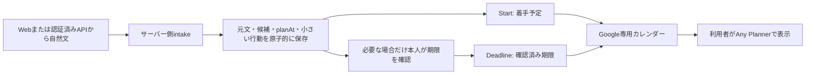

# 自然文受付と着手予定を中心にしたMVP

日常の予定・タイムラインはAny Plannerに任せ、task-controlは入力、締切の正本、着手予定生成、登録漏れ照合、履歴と同期を担当する。配置はFastify + SQLite + worker + Linux/systemdのまま。設計前にmain `9e32205` を確認し、[Issue #7](https://github.com/SHOHE001/task-control/issues/7)に分類と受入条件を記録した。

## 既存機能の分類

| 扱い | 機能 |
| --- | --- |
| 維持 | 期限/予定、未確認/本人確認、作業終了/提出の分離、reopen、履歴、トランザクション、revision、認証/Origin、所有マーカー、バックアップ、週次照合、PWA |
| 簡略化 | 登録は自然文1欄。小さい行動・最初の着手予定を生成し、保存結果だけ表示 |
| 詳細・設定へ | 作業リンク、重要度、見積、終了条件、原文/根拠、変更履歴、Google/Push/AI設定 |
| 廃止候補 | 毎回の手動の一手入力、多段階の登録操作、task-controlを毎日開くことが前提の運用。既存操作・互換APIは今回削除しない |

## データフロー

`src/intake.ts` が受付と規則抽出を担当する。Web側には抽出ロジックを持たせない。Taskの既存 `deadline` と `planAt` を正本として維持し、任意の `intake`（受付日時、基準日時、地域、元表記、解釈メモ）と `startPlan`（予定長、最初の行動、生成元・理由）を追加した。既存TaskのJSONは一括書換えしない。初回のTaskと履歴の保存は既存SQLiteトランザクションにまとめる。

### 締切

- 年月日が揃う絶対日付はdate型の未確認候補。時刻は補わない。
- `9月20日`、`10/20` は年を補わず、unknown型と元表記・不明点を保存する。
- `木曜まで` や `明日まで` も初版では元表記を残し、年月日を本人が確認する。基準日時を持つ場合も自動確定しない。
- 複数日付、無効日付は1つの期限へ勝手に絞らない。
- 締切文と着手希望文を分け、着手日を締切候補へ混ぜない。
- 本人確認は既存のack付き・revision付き期限APIだけで行う。変更履歴は維持する。

### 着手予定

- `明日18時にやる`、`明日の夕方に少しやる`、`今週どこかで30分やりたい`、年を含む絶対日付、曜日の希望に規則で対応する。
- direct入力の相対日時は受付時刻を基準に、設定の地域で解釈。source入力では `referenceAt` がない限り希望日時を作らない。
- 明示した時刻・予定長を優先する。予定長の既定値は20分、受け付ける長さは1〜180分。これは見積学習時間ではない。
- 日付だけの着手希望は18時、朝は9時、夕方は18時を仮に選び、結果に明記する。今週は週内で最初の未来の18時を選ぶ。空き時間や他予定との衝突は照合しない。
- 希望がなく締切も未確認なら、翌日18時の仮予定を1件作る。締切を本人確認すると、自動予定だけを7/3/1/0日前の未来の枠へ変更する。本人の希望・手動変更・手動取消を上書きしない。
- 7/3/1/0日前は候補規則であり、今回はそのうち最初の1件だけ。段階的な複数予定の生成や、自動的な次枠への繰越しは未実装。
- 解釈できない希望、年不明の着手日、過去、無効時刻、夏時間の曖昧な時刻は予定を作らず、理由と変更ボタンを表示する。
- レポートは「資料を1つ開く」、勉強/試験は「問題を1問読む」、その他は「課題ページを開く」を初期行動にする。ユーザー入力や外部AIは不要。

## Google Calendarを接続面にする理由

Google Calendarには公開された[イベント作成仕様](https://developers.google.com/workspace/calendar/api/v3/reference/events/insert)と[private拡張プロパティ](https://developers.google.com/workspace/calendar/api/guides/extended-properties)があり、既存の認可と安全な同期を再利用できる。Any PlannerのGoogle連携は利用者から確認済みだが、専用カレンダーの表示・反映時間は今回実機未検証。Any Plannerの公式一般向けAPIは今回の前提にせず、内部API・Firestore・非公式APIには接続しない。

| 項目 | Deadline | Start |
| --- | --- | --- |
| 正本 | deadline | planAt + startPlan |
| 同期条件 | 本人確認済みで日付あり | 予定あり、作業終了/完了/取消ではない |
| ID | 既存のtask IDハッシュを維持 | task ID + `:start` の別ハッシュ |
| 所有マーカー | taskControlId + kind=deadline（旧マーカーも受理） | taskControlId + kind=startが両方必要 |
| 再試行 | 既存syncテーブル | 新規work_syncテーブル |
| 終了/取消 | 期限は従来通り履歴として残す | 着手イベントを削除、reopenで復元 |

同じStartを再同期しても増殖せず、予定・タイトル・行動の変更を反映する。予定取消は管理中のStartだけ削除する。挿入競合時にも所有を再検査する。更新中にrevisionが変わった場合、古い成功結果を新しい状態の同期済みとして扱わない。ネットワーク送信中の更新は次のworker巡回で収束する。失敗は種類別に最大5回、状態変更と手動再試行で再開できる。Google側の編集は取り込まない。task-controlの次の変更時に上書きされ得るため、予定変更はtask-controlで行う。

## 拡張境界

- 入力adapter：将来LMS/メール/画像adapterが元文を取り出し、`{text, mode: "source", referenceAt?}` に正規化して同じintakeへ渡す。取得/OCR処理は今回実装しない。データ内の文章を命令として実行しない。
- 出力adapter：`eventBody` と `workEventBody` はTaskからDeadline/Startを別々に投影する。現在の `CalendarAdapter.call` はGoogleイベント通信の差替え境界。将来Any Planner公式APIが提供されたら、Taskの同じ正本を読む別providerの同期処理・所有ID・再試行状態を追加する。Google固有URLを別providerへ流用しない。
- 高度AI分解は既存の同意付き候補生成を拡張できるが、intakeの既定動作はローカル規則だけ。AIに期限確定権限を与えない。

## 操作数と残る手動操作

以前も課題名だけの登録は可能だった。今回減らしたのは、その後に着手予定や最初の行動を整える手間である。同じ情報を揃える場合、従来の登録・予定保存・行動編集の3回の保存が、自然文1欄と1回の保存になる。締切を確定したいときだけ追加の確認画面を開く。年が不明ならその入力は省略できない。登録直後の5〜10項目の追加入力はない。

Google認可、専用カレンダーの設定、Any Plannerでの表示選択は初回に必要。予定の調整、未確認期限の確認、提出先での提出確認、週1回の登録漏れ照合は引き続き本人が行う。開始・中断の記録は利用できるが、Calendarに予定を出す前提条件にはしない。

## プライバシーと実機確認

Pushは課題名・元文を含めず、「5分だけ始める時間です」とする。週次照合の通知は維持。課題名付きPushは具体的な行動を促しやすい一方でロック画面へ漏れるため、今回は導入しない。

Calendarには課題名・小さい行動・予定時刻と長さを送る。元文は送らない。既定Calendarリマインダーは無効で、勝手に通知を増やさない。Any Planner側の通知と共有設定は別に確認する必要がある。

1. 専用カレンダーがAny Plannerに表示され、StartとDeadlineを見分けられるか。
2. 日付のみの期限が終日になり、未確認候補が出ないか。
3. 予定変更・取消・作業終了・reopenが重複なく反映されるか、どの程度遅延するか。
4. 課題名が共有カレンダーやロック画面に意図せず出ないか。
5. Pushの到着、週次照合の使い勝手、既定18時/20分が実生活に合うか。

実サービスへのテストデータ送信は行わない。自動検証はfake Calendar/Pushと専用の架空データDBに限定する。
